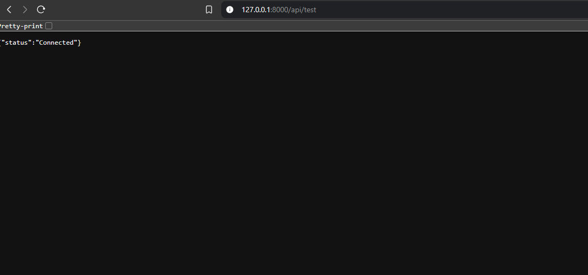
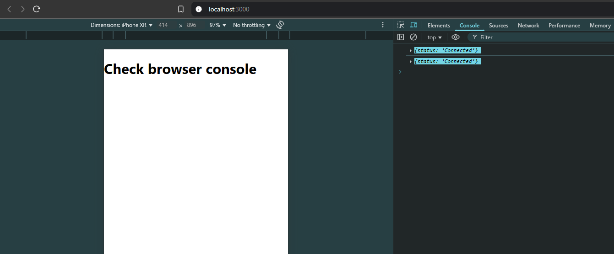

# URL Shortener Project (rq.fyi)

A simple URL shortener with Laravel backend and React frontend.

## Project Structure
```bash
rq.fyi/
├── rq.fyi-api/ (Laravel backend)
└── rq.fyi-frontend/ (React frontend)
```


## Quick Start (Run everything locally)

1. **Backend Setup**
   ```bash
   cd rq.fyi-api
   composer install
   cp .env.example .env
   php artisan key:generate
   
   # Configure database in .env: (it uses sqlite by default)
   DB_CONNECTION=mysql
   DB_HOST=127.0.0.1
   DB_PORT=3306
   DB_DATABASE=your_db_name
   DB_USERNAME=your_db_user
   DB_PASSWORD=your_db_pass
   
   php artisan migrate
   php artisan serve --port=8000

2. **Frontend Setup**
     ```bash
    cd rq.fyi-frontend
    npm install
    npm run dev # or yarn / bun

# Key Things to Know
## Backend (Laravel)
- We use Laravel Sanctum for API authentication

Important files:

- **routes/api.php** – Defines our API endpoints.  
- **app/Http/V1/Controllers/** – Contains our controller logic.  
- **app/Permissions/V1/Abilities.php** – Defines token abilities based on user roles.  
- **app/Policies/V1/** – Uses `Abilities.php` to enforce rules and restrictions on models. [Authorization Docs](https://laravel.com/docs/12.x/authorization)  
- **app/Http/Resources/V1/** – Contains model resources that return JSON arrays. [Eloquent Resources Docs](https://laravel.com/docs/12.x/eloquent-resources)  
- **app/Models/** – Defines our data models (database tables). [Eloquent Relationships Docs](https://laravel.com/docs/11.x/eloquent-relationships)   

## Frontend (React)
- Uses Axios to connect to our Laravel API
- Main files are in src/ directory

# API Endpoints
```php
// Keep in mind these are just examples.

Route::post('/shorten', [LinkController::class, 'store']); // Shorten a URL
Route::get('/{code}', [LinkController::class, 'redirect']); // Redirect short URL
Route::get('/links', [LinkController::class, 'index'])->middleware('auth:sanctum'); // List all links (requires auth) -> https://laravel.com/docs/12.x/sanctum

// etc.
```

#  What We Need to Build
## Backend Tasks
- Create a job to migrate old database data into the new tables.  
- Create the models and controllers.  
- Implement the URL shortening logic. 
- Define abilities in `Abilities.php`.   
- Set up policies for access control.  
- Create JSON resources for structured API responses.  
- Add filters and other necessary features.  

## Frontend Tasks
- Create a form to submit URLs
- Show the shortened URL after creation
- Display analytics (clicks, etc.) // optional, but a fun exercise

# Visual Reference

____________________________________________________________________




